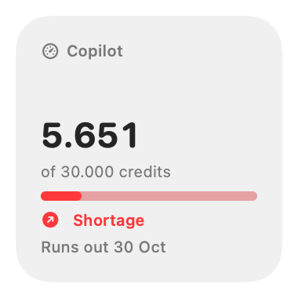
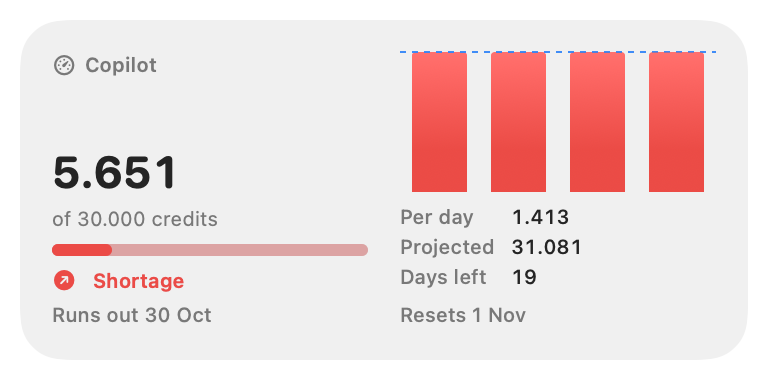
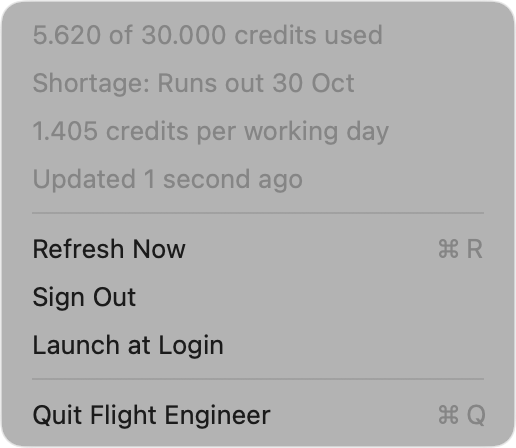

# Flight Engineer

A macOS desktop widget that keeps an eye on your GitHub Copilot AI credits.

In an aircraft cockpit, the *flight engineer* is the third crew member next to
the pilot and the copilot, monitoring the aircraft's systems and fuel. This app
does the same for your Copilot: it tracks how many AI credits you have used this
month and projects whether you will run out before the quota resets.

> [!NOTE]
> This project is vibe coded: it was written almost entirely by an AI coding
> assistant, with a human steering, testing and reviewing. It works on the
> author's machine, but expect rough edges and review the code before relying
> on it.

<p align="center">
  
  
</p>

## Features

- Desktop widget (small and medium) showing the AI credits used this month,
  the monthly quota, and the outlook:
  - **Credits left**: projected usage stays below 90% of the quota
  - **Reaching quota**: projected usage ends up between 90% and 100%
  - **Shortage**: projected usage exceeds the quota, with the expected
    depletion day
- Menu bar app that signs in to GitHub and refreshes the usage every 15
  minutes and when the Mac wakes up.

## How the forecast works

GitHub only reports the current number of credits used, so Flight Engineer
records a snapshot on every refresh and derives the consumption per working
day (Monday to Friday) from them:

1. Usage between two snapshots is spread evenly over the working days in
   between. Usage on weekends is attributed to the next working day. On the
   first run, the credits used so far are spread over the working days
   elapsed since the start of the period.
2. The daily rate is a linearly weighted average of the last ten complete
   working days. Recent days weigh more, but never more than twice as much as
   the oldest one, so a single heavy day does not skew the forecast. Early in
   the month, days from the previous period are used too. Days without data
   are filled with the average of the known days.
3. The projection is the current usage plus the daily rate for each working
   day left until the quota resets (midnight UTC on the reset date).

## Installation

Flight Engineer requires macOS 14 (Sonoma) or later. Install it with
[Homebrew](https://brew.sh):

```sh
brew install --cask floriandejonckheere/flight-engineer/flight-engineer
```

The app is ad-hoc signed and not notarized; the cask removes the quarantine
attribute so macOS allows it to run.

## Building

Building from source requires Xcode 16 or later and
[XcodeGen](https://github.com/yonaskolb/XcodeGen) (`brew install xcodegen`).


```sh
make install   # builds a release version and copies it to /Applications
make test      # runs the unit tests
```

Use `make install INSTALL_DIR=~/Applications` to install elsewhere. To work in
Xcode, run `make generate` and open `FlightEngineer.xcodeproj`.

The app is ad-hoc signed and does not need an Apple Developer account. To sign
with your own team, copy `Config/Local.xcconfig.example` to
`Config/Local.xcconfig` and fill in your team ID.

## Releasing

1. Tag the release and push the tag:

   ```sh
   git tag -a v1.1.0 -m "Flight Engineer 1.1.0"
   git push origin v1.1.0
   ```

2. The release workflow builds a universal app and attaches
   `FlightEngineer-<version>.zip` to a GitHub release.
3. Update `version` and `sha256` in the cask of the
   [Homebrew tap](https://github.com/floriandejonckheere/homebrew-flight-engineer):

   ```sh
   gh release download v1.1.0 -p '*.zip' -O - | shasum -a 256
   ```

## Usage

1. Launch Flight Engineer. A gauge icon appears in the menu bar.
2. Choose **Sign In…** and sign in to GitHub. Once signed in, the menu shows
   your current usage and forecast:

   <p align="center"></p>

3. Right-click the desktop, choose **Edit Widgets…**, search for
   **Flight Engineer**, and drag the small or medium widget onto the desktop.

## Privacy

Flight Engineer reads your usage from the private
`https://github.com/github-copilot/chat/entitlement` endpoint, using the
GitHub session from the built-in sign-in window. The session cookie stays in
the app's WebKit data store and is only sent to github.com. Usage history is
stored in `~/Library/Application Support/FlightEngineer/state.json`.

As this endpoint is undocumented, it may change or stop working at any time.

## Architecture

| Path                         | Description                                        |
|------------------------------|----------------------------------------------------|
| `App/`                       | Menu bar app: sign-in, fetching, state persistence |
| `Widget/`                    | WidgetKit extension rendering the shared state     |
| `Packages/FlightEngineerKit` | Entitlement parsing, forecasting, shared state     |
| `project.yml`                | XcodeGen project specification                     |

The widget runs sandboxed, which normally requires an App Group to share data
with the app. As App Groups require a developer team, the widget instead
reads the state file through a read-only sandbox exception for
`~/Library/Application Support/FlightEngineer/`.

## License

Released under the [MIT License](LICENSE).
